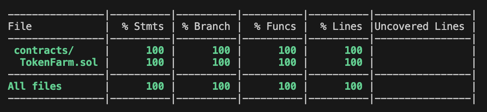

# RareSkills Advanced Solidity Bootcamp - week 2

This repo contains Markdown files and Solidity contracts for the week 2 assignmewnt regarding ERC2721 Tokens, Staking, and Security.

Solidity Contracts:
- [NFT Minting with whitelist](./contracts/MyNFT.sol) - Uses a Merkle tree and BitMaps for efficient whitelist management.
- [NFT Staking in Token Farm](./contracts/TokenFarm.sol) - Stake an NFT and farm an ERC20 token as a reward.
- [Reward Token](./contracts/token/RewardToken.sol)  - Token earned as a reward for staking an NFT in Token Farm.


### TokenFarm Test Coverage 
```
npx hardhat coverage --testfiles test/token_farm_tests.ts 
```



### TokenFarm Slither

```
slither --exclude-dependencies .

INFO:Slither:. analyzed (28 contracts with 93 detectors), 0 result(s) found
```

